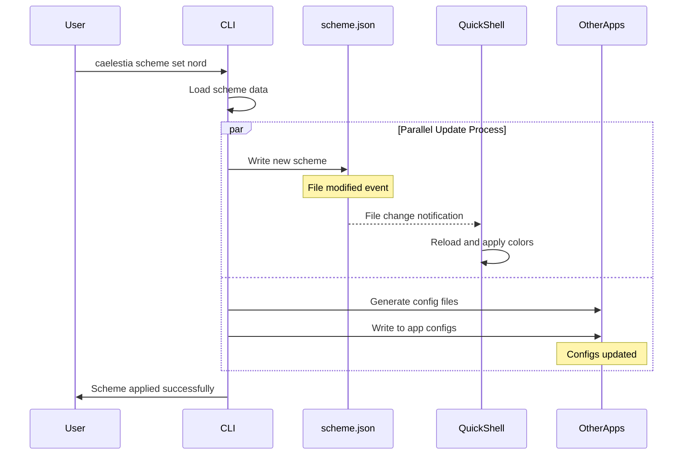

# Color Scheme Update Flow in Caelestia

## Overview

Caelestia employs two parallel mechanisms for updating color schemes across different applications, designed to accommodate varying application architectures and capabilities. This document details how these mechanisms work together to provide a unified theming experience.

## The Two Parallel Update Mechanisms

### 1. Direct File Watching (Pull-Based)
- **Used by**: QuickShell and other reactive applications
- **Mechanism**: Applications monitor `scheme.json` for changes
- **Update timing**: Immediate upon file modification
- **Responsibility**: Application handles its own updates

### 2. Active Application by CLI (Push-Based)
- **Used by**: Traditional applications (Kitty, Neovim, GTK, etc.)
- **Mechanism**: CLI generates and writes configuration files
- **Update timing**: During `caelestia scheme set` execution
- **Responsibility**: CLI manages the update process

## scheme.json: The Central Source of Truth

```
~/.config/caelestia/scheme.json
├── Monitored by file watchers (QuickShell)
├── Read by CLI for generation
└── Single source for all color data
```

### Key Roles:
1. **Central Repository**: Stores the active color scheme data
2. **Change Trigger**: File modification triggers watchers
3. **Generation Source**: CLI reads this to generate app-specific configs
4. **Synchronization Point**: Ensures all apps use the same scheme

## Step-by-Step Update Flow

### When `caelestia scheme set <scheme>` is executed:



### Detailed Steps:

#### 1. CLI Initialization
```python
def set_scheme(scheme_name):
    # Load the requested scheme
    scheme_data = load_scheme(scheme_name)
    
    # Update central source of truth
    write_scheme_json(scheme_data)
    
    # Apply to all configured applications
    apply_colours(scheme_data)
```

#### 2. QuickShell's Automatic Reaction
```qml
// QuickShell configuration watching scheme.json
FileView {
    id: schemeWatcher
    path: "~/.config/caelestia/scheme.json"
    
    onTextChanged: {
        // Automatically triggered when CLI updates scheme.json
        const newScheme = JSON.parse(text);
        applyColorScheme(newScheme);
    }
}
```

#### 3. CLI's Active Application
```python
def apply_colours(scheme_data):
    """Apply colors to all configured applications"""
    
    # Each application gets its specific format
    for app in configured_apps:
        if app == "kitty":
            generate_kitty_config(scheme_data)
        elif app == "nvim":
            generate_nvim_config(scheme_data)
        elif app == "gtk":
            generate_gtk_css(scheme_data)
        # ... more applications
```

## Why Different Approaches Are Needed

### Applications That Can Watch Files

**Characteristics:**
- Modern, reactive frameworks
- Built-in file monitoring capabilities
- Can update UI without restart

**Examples:**
- QuickShell (QML-based)
- Some Electron apps
- Modern desktop environments

**Benefits:**
- Zero-latency updates
- No CLI intervention needed
- Self-managing

### Applications That Need Config Files

**Characteristics:**
- Traditional configuration model
- Read config at startup or on reload
- Static configuration files

**Examples:**
- Terminal emulators (Kitty, Alacritty)
- Text editors (Neovim, Vim)
- Window managers

**Benefits:**
- Works with existing config systems
- Persistent across restarts
- No modification to app needed

### Applications That Need Direct Updates

**Characteristics:**
- Running daemons or services
- Can't watch files efficiently
- Need explicit reload signals

**Examples:**
- GTK applications
- System services
- Background daemons

**Benefits:**
- Ensures update is applied
- Can trigger reload mechanisms
- Handles complex update logic

## Code Examples

### QuickShell's File Watching Implementation

```qml
// ~/.config/quickshell/colors.qml
import QtQuick
import Quickshell.Io

Singleton {
    property var colors: ({})
    
    FileView {
        id: colorScheme
        path: `${StandardPaths.config}/caelestia/scheme.json`
        
        // Automatic trigger on file change
        onTextChanged: {
            try {
                colors = JSON.parse(text);
                console.log("Color scheme updated:", colors.name);
                
                // Colors immediately available throughout QuickShell
                root.backgroundColor = colors.base00;
                root.foregroundColor = colors.base05;
            } catch (e) {
                console.error("Failed to parse scheme:", e);
            }
        }
    }
}
```

### CLI's apply_colours() Function

```python
def apply_colours():
    """Apply the current color scheme to all configured applications"""
    
    # Read the source of truth
    with open(SCHEME_PATH, 'r') as f:
        scheme = json.load(f)
    
    # Parallel application to different app types
    tasks = []
    
    # Type 1: Config file generation
    if "kitty" in config.applications:
        tasks.append(generate_kitty_theme(scheme))
    
    if "nvim" in config.applications:
        tasks.append(generate_nvim_theme(scheme))
    
    # Type 2: Direct application
    if "gtk" in config.applications:
        tasks.append(apply_gtk_theme(scheme))
    
    # Type 3: Signal-based reload
    if "waybar" in config.applications:
        tasks.append(reload_waybar(scheme))
    
    # Execute all tasks
    for task in tasks:
        task.execute()
    
    print(f"Applied {scheme['name']} to {len(tasks)} applications")
```

### Parallel Update Example

```python
# When scheme.json is updated
def on_scheme_change():
    """Demonstrates parallel update paths"""
    
    # Path 1: File watchers react immediately
    # QuickShell detects change and updates (no CLI involvement)
    
    # Path 2: CLI actively updates others
    with ThreadPoolExecutor() as executor:
        futures = []
        
        # Generate all configs in parallel
        futures.append(executor.submit(update_kitty))
        futures.append(executor.submit(update_nvim))
        futures.append(executor.submit(update_gtk))
        
        # Wait for all to complete
        for future in futures:
            future.result()
```

## Visual Flow Diagrams

### Complete Update Flow

```
┌─────────────┐
│    User     │
└──────┬──────┘
       │ caelestia scheme set
       ▼
┌─────────────┐
│     CLI     │
└──────┬──────┘
       │
       ├─────────────────────────────┐
       ▼                             ▼
┌──────────────┐            ┌────────────────┐
│ scheme.json  │            │ apply_colours()│
└──────┬───────┘            └────────┬───────┘
       │                             │
       │ File Change Event           │ Direct Write
       │                             │
       ▼                             ▼
┌──────────────┐            ┌────────────────┐
│  QuickShell  │            │   Other Apps   │
│   (Watcher)  │            │ (Kitty, Nvim)  │
└──────────────┘            └────────────────┘
```

### Push vs Pull Mechanisms

```
PULL-BASED (Reactive)           PUSH-BASED (Active)
─────────────────────           ───────────────────

scheme.json ──► FileWatcher     CLI ──► Config Files
     │              │                        │
     │              ▼                        ▼
     └──────► Auto-Update           Application Reads
                                    (on start/reload)

Timing: Immediate               Timing: On CLI execution
Control: Application            Control: CLI
Examples: QuickShell           Examples: Kitty, Neovim
```

### Update Dependencies and Timing

```
T=0ms   : CLI receives "scheme set" command
T=10ms  : CLI loads scheme data
T=20ms  : CLI writes to scheme.json ─────┐
T=25ms  : CLI starts apply_colours() ────┼───┐
         │                                │   │
T=30ms  : │ QuickShell detects change ◄──┘   │
T=35ms  : │ QuickShell updates UI             │
         │                                    │
T=50ms  : └─► Kitty config written ◄─────────┘
T=60ms  : └─► Nvim config written
T=70ms  : └─► GTK CSS generated
T=80ms  : CLI reports completion

Legend: ──► Push/Write  ◄── Pull/Read
```

## Best Practices

### For File-Watching Applications
1. Monitor `scheme.json` directly
2. Parse and apply changes immediately
3. Handle parse errors gracefully
4. Provide visual feedback on update

### For Config-Based Applications
1. Store configs in standard locations
2. Support hot-reload where possible
3. Document manual reload requirements
4. Maintain config file comments

### For CLI Implementation
1. Update `scheme.json` first (triggers watchers)
2. Run apply_colours() in parallel where possible
3. Provide clear success/failure feedback
4. Log which applications were updated

## Summary

Caelestia's dual-mechanism approach ensures comprehensive theme application across diverse application architectures:

- **File watchers** provide instant, zero-latency updates for capable applications
- **CLI generation** ensures compatibility with traditional applications
- **scheme.json** serves as the single source of truth, coordinating both mechanisms
- **Parallel execution** ensures efficient, fast updates across all applications

This architecture balances modern reactive patterns with backward compatibility, ensuring a consistent theming experience regardless of application capabilities.