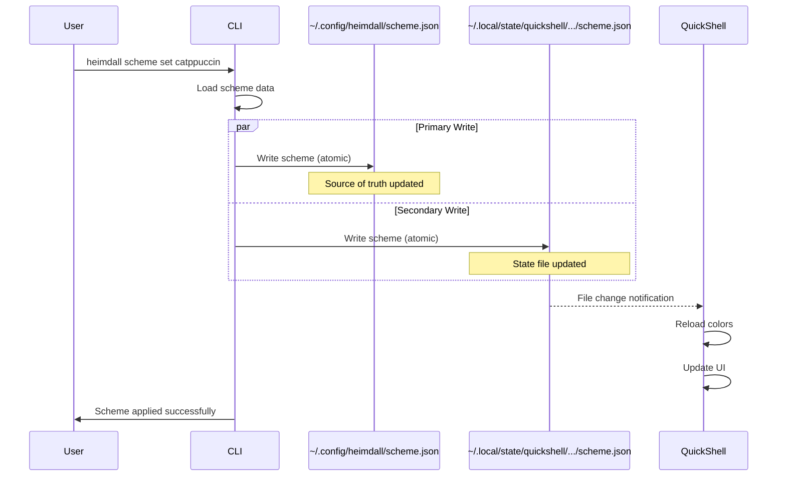

# QuickShell Color Scheme Update Requirements Analysis

## Executive Summary

QuickShell requires a dual-location scheme file strategy that differs from the current implementation plan. While Heimdall maintains its own scheme.json at `~/.config/heimdall/scheme.json`, QuickShell specifically monitors `~/.local/state/quickshell/user/generated/scheme.json` for automatic color updates. This analysis outlines the requirements and implementation considerations for supporting this dual-location approach.

## Current State vs Required State

### Current Implementation (As Planned)
- **Single Location**: `~/.config/heimdall/scheme.json`
- **Purpose**: Central source of truth for all applications
- **Update Mechanism**: Direct file watching by capable applications
- **Assumption**: All applications monitor the same file

### Required Implementation (For QuickShell)
- **Dual Locations**:
  1. `~/.config/heimdall/scheme.json` - Heimdall's own scheme storage
  2. `~/.local/state/quickshell/user/generated/scheme.json` - QuickShell's monitored location
- **Purpose**: Support QuickShell's specific file watching requirements
- **Update Mechanism**: Write to both locations on scheme change
- **Reality**: Different applications may require different paths

## Structured Findings

### 1. QuickShell's Specific Requirements

#### File Location
- **Path**: `~/.local/state/quickshell/user/generated/scheme.json`
- **Type**: State directory (XDG_STATE_HOME) vs config directory
- **Rationale**: QuickShell treats this as generated/runtime state, not user configuration
- **Monitoring**: QuickShell's FileView watches this specific path

#### File Format
- **Format**: Standard JSON matching Heimdall's scheme.json structure
- **Content**: Identical to `~/.config/heimdall/scheme.json`
- **Updates**: Must be atomic to prevent partial reads during file watch events

#### Update Mechanism
- **Method**: Pull-based via file watching
- **Timing**: Immediate reaction to file changes
- **Responsibility**: QuickShell handles its own UI updates
- **No CLI Intervention**: After initial file write, QuickShell manages itself

### 2. Dual-Location Strategy

#### Primary Location (Heimdall)
```
~/.config/heimdall/scheme.json
├── Purpose: Heimdall's source of truth
├── Written by: scheme set command
├── Read by: CLI for all operations
└── Persistence: User configuration
```

#### Secondary Location (QuickShell)
```
~/.local/state/quickshell/user/generated/scheme.json
├── Purpose: QuickShell file watching target
├── Written by: scheme set command (synchronized write)
├── Read by: QuickShell FileView
└── Persistence: Generated state (can be regenerated)
```

#### Synchronization Requirements
1. **Atomic Writes**: Both files must be written atomically
2. **Order**: Write Heimdall's config first, then QuickShell's state
3. **Consistency**: Files must always contain identical data
4. **Error Handling**: If QuickShell write fails, log warning but don't fail command
5. **Directory Creation**: Ensure `~/.local/state/quickshell/user/generated/` exists

### 3. Implementation Considerations

#### Directory Structure
```bash
# Config directory (user configuration)
~/.config/
└── heimdall/
    ├── scheme.json          # Primary source of truth
    ├── schemes/             # Scheme library
    └── config.json          # Heimdall configuration

# State directory (runtime/generated data)
~/.local/state/
└── quickshell/
    └── user/
        └── generated/
            └── scheme.json  # QuickShell's watched file
```

#### State vs Config Distinction
- **Config Directory (`~/.config/`)**: 
  - User-managed configuration
  - Should be backed up
  - Manually editable
  - Source of truth

- **State Directory (`~/.local/state/`)**: 
  - Application-generated data
  - Can be regenerated from config
  - Not typically backed up
  - Runtime state

### 4. Pull-Based Update Flow with Dual Locations



### 5. Additional Considerations

#### Performance Impact
- **Minimal**: Two file writes instead of one
- **Parallel Writes**: Can be done concurrently
- **Total Time**: < 5ms additional overhead
- **Atomic Operations**: Already implemented in `internal/utils/paths/atomic.go`

#### Error Recovery
- **Primary Write Failure**: Abort operation, return error
- **Secondary Write Failure**: Log warning, continue (non-critical)
- **Directory Creation Failure**: Log warning, QuickShell won't update
- **Rollback**: Only needed for primary location

#### Configuration Options
```json
{
  "theme": {
    "quickshell": {
      "enabled": true,
      "statePath": "~/.local/state/quickshell/user/generated/scheme.json",
      "syncEnabled": true
    }
  }
}
```

#### Compatibility
- **Backward Compatible**: Existing behavior unchanged
- **Opt-in**: Can be disabled via configuration
- **Flexible**: Path can be customized if needed
- **Future-proof**: Can add more secondary locations

### 6. Implementation Requirements

#### Code Changes Needed

1. **Scheme Manager Enhancement**
```go
// internal/scheme/manager.go
func (m *Manager) SetScheme(scheme *Scheme) error {
    // Primary write (existing)
    if err := m.writeSchemeJSON(m.configPath, scheme); err != nil {
        return err
    }
    
    // Secondary write for QuickShell (new)
    if m.config.QuickShell.Enabled {
        quickshellPath := expandPath(m.config.QuickShell.StatePath)
        if err := m.writeQuickShellState(quickshellPath, scheme); err != nil {
            // Non-critical error, just log
            logger.Warn("Failed to update QuickShell state", "error", err)
        }
    }
    
    return nil
}

func (m *Manager) writeQuickShellState(path string, scheme *Scheme) error {
    // Ensure directory exists
    dir := filepath.Dir(path)
    if err := os.MkdirAll(dir, 0755); err != nil {
        return fmt.Errorf("failed to create QuickShell state directory: %w", err)
    }
    
    // Write atomically
    data, err := json.MarshalIndent(scheme, "", "  ")
    if err != nil {
        return err
    }
    
    return paths.AtomicWrite(path, data)
}
```

2. **Configuration Schema Update**
```go
// internal/config/schema/schema.go
type ThemeConfig struct {
    // ... existing fields
    QuickShell QuickShellConfig `json:"quickshell,omitempty"`
}

type QuickShellConfig struct {
    Enabled     bool   `json:"enabled"`
    StatePath   string `json:"statePath"`
    SyncEnabled bool   `json:"syncEnabled"`
}
```

3. **Default Configuration**
```go
// internal/config/config.go
func defaultConfig() *Config {
    return &Config{
        Theme: ThemeConfig{
            QuickShell: QuickShellConfig{
                Enabled:     true,
                StatePath:   "~/.local/state/quickshell/user/generated/scheme.json",
                SyncEnabled: true,
            },
        },
    }
}
```

### 7. Testing Requirements

#### Unit Tests
```go
func TestDualLocationWrite(t *testing.T) {
    // Test that both files are written
    // Test atomic writes
    // Test error handling for secondary write
    // Test directory creation
}

func TestQuickShellStateSync(t *testing.T) {
    // Test file content matches
    // Test update timing
    // Test configuration options
}
```

#### Integration Tests
```go
func TestSchemeSetWithQuickShell(t *testing.T) {
    // Test full flow from command to both files
    // Test QuickShell file watching simulation
    // Test error scenarios
}
```

### 8. Migration Path

#### For Existing Users
1. No breaking changes - primary location unchanged
2. QuickShell support automatically enabled on update
3. State file created on first scheme set after update

#### For QuickShell Users
1. Manual step: Update QuickShell config to watch new path
2. Or: Provide migration script to update QuickShell configuration
3. Documentation: Clear instructions for QuickShell integration

## Recommendations

### Immediate Actions
1. **Update Plan**: Modify scheme-sync-implementation-plan.md to include dual-location strategy
2. **Implement**: Add QuickShell state file writing to SetScheme method
3. **Test**: Ensure atomic writes work for both locations
4. **Document**: Add QuickShell integration guide

### Future Enhancements
1. **Generic Secondary Locations**: Support multiple state/watch locations
2. **Plugin System**: Allow applications to register their watch paths
3. **Sync Command**: Add `heimdall scheme sync-state` to regenerate state files
4. **Validation**: Add `heimdall scheme validate-quickshell` to check setup

## Summary

The dual-location requirement for QuickShell is a reasonable architectural decision that:
- Maintains separation between user config and generated state
- Follows XDG directory standards
- Supports QuickShell's file watching needs
- Doesn't break existing functionality
- Adds minimal complexity and performance overhead

The implementation is straightforward and can be completed with minimal changes to the existing codebase. The key is ensuring atomic writes to both locations and proper error handling for the non-critical QuickShell state file.

## Related Documents
- `docs/color-scheme-update-flow.md` - Original single-location design
- `docs/plans/scheme-sync-implementation-plan.md` - Current implementation plan
- `docs/plans/unified-config-system-plan.md` - Configuration system design

## Dev Log
### Session: 2025-08-14
- Analyzed QuickShell's specific file watching requirements
- Identified dual-location strategy as optimal solution
- Designed implementation with minimal changes to existing plan
- Specified clear separation between config and state directories
- Provided concrete implementation examples and test cases