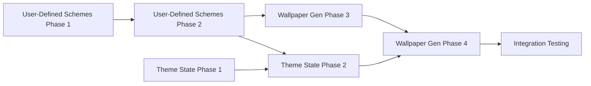

# Implementation Roadmap: Theme Infrastructure

## Overview
This document provides a clear implementation order for the three interconnected theme infrastructure plans, ensuring proper dependency management and efficient development.

## Implementation Order

### Priority 1: User-Defined Schemes Infrastructure

**Plan**: `docs/plans/user-defined-schemes-plan.md`  
**Status**: ✅ COMPLETE - Foundation ready for dependent plans  
**Timeline**: Completed

#### Why First?

- Provides core infrastructure for scheme storage and discovery
- Enables source tracking (bundled/user/generated)
- Required by both other plans for their storage needs
- No external dependencies

#### Key Deliverables

- **Phase 1**: Configuration infrastructure for user scheme paths
- **Phase 2**: Extended Manager with multi-source support
- **Phase 3**: Command updates with source awareness
- **Phase 4**: Validation and error handling
- **Phase 5**: Testing and documentation

#### Blocking Items for Other Plans

Phase 2 completion blocks:
- Wallpaper Generation Phase 3 (Storage)
- Theme State Management Phase 2 (Command Integration)

### Priority 2A: Theme State Management

**Plan**: `docs/plans/theme-state-management-plan.md`  
**Status**: Ready to proceed - All phases unblocked  
**Timeline**: Weeks 2-3

#### All Phases Now Unblocked

With User-Defined Schemes complete, all phases can proceed:
- **Phase 1**: State Model and Storage
- **Phase 2**: Command Integration
- **Phase 3**: Auto-Apply Logic
- **Phase 4**: History and Rollback
- **Phase 5**: Testing and Documentation

### Priority 2B: Wallpaper Generation Improvements

**Plan**: `docs/plans/wallpaper-generation-improvements-plan.md`  
**Status**: Ready to proceed - Dependencies satisfied  
**Timeline**: Weeks 2-4

#### Dependencies

- **Hard Dependency**: ✅ User-Defined Schemes (COMPLETE - storage infrastructure ready)
- **Soft Dependency**: Theme State Management Phase 2 (for better UX)

#### Key Integration Points

- **Phase 3**: Uses User-Defined Schemes storage paths
- **Phase 4**: Coordinates with Theme State for preference tracking

## Parallel Development Opportunities

### Current Status (Priority 1 Complete)

With User-Defined Schemes infrastructure complete, all teams can now proceed in parallel:

### Week 2 (Current)

- **Team A**: Theme State Management Phase 1-3
- **Team B**: Wallpaper Generation Phase 1-3
- **Team C**: Integration testing of User-Defined Schemes

### Week 3

- **Team A**: Theme State Management Phase 4-5
- **Team B**: Wallpaper Generation Phase 4-5
- **Team C**: Cross-system integration testing

### Week 4

- **All Teams**: Final integration and testing
- Complete end-to-end workflow validation
- Documentation and release preparation

## Critical Path

## Integration Checkpoints

### Checkpoint 1: After User-Defined Schemes (✅ COMPLETE)

- ✅ Scheme discovery works with multiple sources
- ✅ Source tracking functional (bundled/user/generated)
- ✅ Storage paths accessible and configurable
- ✅ **Result**: Both other plans now unblocked and ready to proceed

### Checkpoint 2: After Theme State Phase 2

- Verify state persistence works
- Confirm command integration functional
- Test source type tracking
- **Enables**: Full wallpaper integration

### Checkpoint 3: After Wallpaper Generation Phase 3

- Verify generated schemes stored correctly
- Confirm schemes discoverable
- Test variant generation
- **Enables**: Final integration

### Checkpoint 4: Final Integration

- Test complete workflow: wallpaper → generation → storage → state → application
- Verify all three systems work together
- Confirm user preferences respected
- Test auto-apply logic

## Risk Mitigation

### Risk 1: Delayed User-Defined Schemes

**Impact**: Blocks both other plans  
**Mitigation**:
- Prioritize Phase 1-2 completion
- Add more resources if needed
- Create mock interfaces for parallel development

### Risk 2: Integration Issues

**Impact**: Features don't work together properly  
**Mitigation**:
- Regular integration checkpoints
- Shared interface definitions early
- Continuous integration testing

### Risk 3: State Corruption

**Impact**: Loss of user preferences and history  
**Mitigation**:
- Implement atomic operations from start
- Add state validation at each checkpoint
- Create backup/recovery mechanisms early

## Success Criteria

### Phase 1 Success (Week 1) - ✅ COMPLETE
- [x] User-Defined Schemes fully implemented
- [x] Multi-source scheme discovery working
- [x] Source tracking functional
- [x] Configuration system extended
- [x] Commands updated with source awareness
- [x] Basic integration tests passing

### Phase 2 Success (Week 2) - IN PROGRESS
- [ ] Theme State Phase 1-3 complete
- [ ] Wallpaper Generation Phase 1-3 complete
- [ ] Integration between systems verified

### Phase 3 Success (Week 3-4)
- [ ] All plans fully implemented
- [ ] End-to-end integration tests passing
- [ ] User acceptance testing complete
- [ ] Documentation updated

## Communication Plan

### Daily Sync Points
- Morning: Dependency status check
- Afternoon: Integration point review

### Weekly Reviews
- Monday: Plan progress and blockers
- Friday: Integration testing results

### Escalation Path
1. Technical blockers → Tech Lead
2. Resource issues → Project Manager
3. Scope changes → Product Owner

## Conclusion

The foundation is now complete:

**1. User-Defined Schemes** ✅ COMPLETE - Foundation infrastructure ready  
**2. Theme State Management** Ready to proceed with all phases  
**3. Wallpaper Generation** Ready to proceed with full implementation

Current status:
- Priority 1 (foundation) is complete
- All Priority 2 plans are now unblocked
- Teams can work in parallel on remaining features
- Integration points are clear and dependencies satisfied

## Dev Log

### Session: Roadmap Creation - 2025-08-15
- Created comprehensive implementation roadmap
- Defined clear dependencies and order
- Identified parallel development opportunities
- Established integration checkpoints
- Next steps: Begin User-Defined Schemes Phase 1

### Session: Priority 1 Completion - 2025-08-15
- ✅ User-Defined Schemes implementation COMPLETE
- ✅ All phases successfully implemented and tested
- ✅ Multi-source scheme discovery functional
- ✅ Configuration system extended with user paths
- ✅ Commands updated with source awareness
- ✅ Foundation infrastructure ready
- Status: Priority 2 plans (Theme State Management and Wallpaper Generation) now unblocked
- Next steps: Teams can proceed in parallel with remaining features