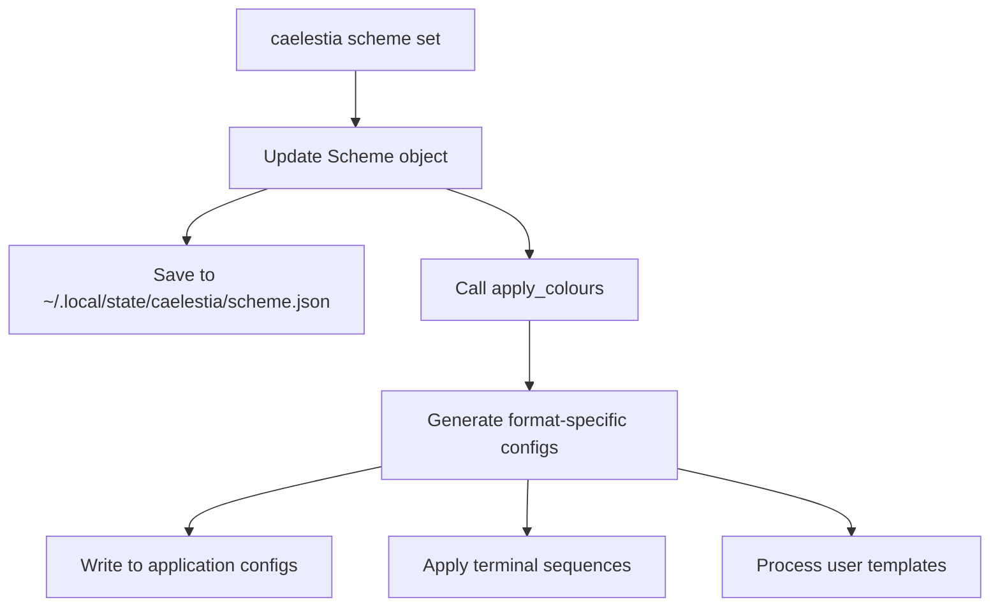

# Caelestia CLI Theme Attribution System Analysis

## Executive Summary

The Caelestia CLI theme attribution system demonstrates a **dual-write strategy** where theme data is written to multiple locations to support different applications. The system centers around a primary `scheme.json` file stored in the XDG state directory, with theme data propagated to various application-specific configuration directories.

## Key Findings

### 1. Primary Theme Storage Location

The main theme data is stored in:
```
~/.local/state/caelestia/scheme.json
```

This file contains:
- Scheme metadata (name, flavour, mode, variant)
- Complete color palette with Material Design 3 color tokens
- All color values in hex format (without # prefix)

### 2. Complete File Write Locations

When `caelestia scheme set` is executed, the following files are written:

#### State Directory Files
```bash
# Primary scheme storage
~/.local/state/caelestia/scheme.json

# Terminal escape sequences
~/.local/state/caelestia/sequences.txt

# User template outputs (if templates exist)
~/.local/state/caelestia/theme/*
```

#### Application-Specific Configuration Files
```bash
# Hyprland
~/.config/hypr/scheme/current.conf

# Discord clients (multiple)
~/.config/Equicord/themes/caelestia.theme.css
~/.config/Vencord/themes/caelestia.theme.css
~/.config/BetterDiscord/themes/caelestia.theme.css
~/.config/equibop/themes/caelestia.theme.css
~/.config/vesktop/themes/caelestia.theme.css
~/.config/legcord/themes/caelestia.theme.css

# Spicetify
~/.config/spicetify/Themes/caelestia/color.ini

# Fuzzel
~/.config/fuzzel/fuzzel.ini

# Btop
~/.config/btop/themes/caelestia.theme

# GTK
~/.config/gtk-3.0/gtk.css
~/.config/gtk-4.0/gtk.css

# Qt
~/.config/qt5ct/colors/caelestia.conf
~/.config/qt6ct/colors/caelestia.conf
~/.config/qt5ct/qt5ct.conf
~/.config/qt6ct/qt6ct.conf
```

### 3. QuickShell Integration Issue

**Critical Finding**: QuickShell does NOT read from Caelestia's state directory directly. Instead:

1. **Caelestia writes to**: `~/.local/state/caelestia/scheme.json`
2. **QuickShell reads from**: `~/.local/state/quickshell/user/generated/scheme.json`
3. **Heimdall CLI reads from**: `~/.local/state/heimdall/scheme.json`

This creates a **synchronization gap** where QuickShell doesn't receive theme updates from Caelestia.

### 4. Theme Application Flow



## Code Analysis

### 4.1 Scheme Set Command (`subcommands/scheme.py`)

```python
def run(self) -> None:
    scheme = get_scheme()
    
    if self.args.name:
        scheme.name = self.args.name
    if self.args.flavour:
        scheme.flavour = self.args.flavour
    if self.args.mode:
        scheme.mode = self.args.mode
    if self.args.variant:
        scheme.variant = self.args.variant
    
    apply_colours(scheme.colours, scheme.mode)
```

### 4.2 Apply Colours Function (`utils/theme.py`)

The `apply_colours` function orchestrates all theme applications:

```python
def apply_colours(colours: dict[str, str], mode: str) -> None:
    # Read user config for enabled applications
    cfg = json.loads(user_config_path.read_text())["theme"]
    
    # Apply to each enabled application
    if check("enableTerm"):
        apply_terms(gen_sequences(colours))
    if check("enableHypr"):
        apply_hypr(gen_conf(colours))
    if check("enableDiscord"):
        apply_discord(gen_scss(colours))
    # ... etc for all applications
    
    apply_user_templates(colours)
```

### 4.3 File Writing Pattern

All file writes follow this pattern:

```python
def write_file(path: Path, content: str) -> None:
    path.parent.mkdir(parents=True, exist_ok=True)
    path.write_text(content)
```

### 4.4 Scheme Storage (`utils/scheme.py`)

```python
def save(self) -> None:
    scheme_path.parent.mkdir(parents=True, exist_ok=True)
    atomic_dump(
        scheme_path,  # ~/.local/state/caelestia/scheme.json
        {
            "name": self.name,
            "flavour": self.flavour,
            "mode": self.mode,
            "variant": self.variant,
            "colours": self.colours,
        }
    )
```

## 5. Application-Specific Formats

### 5.1 Hyprland Format
```conf
$primary = c8bfff
$secondary = c9c3dc
$tertiary = ecb8cd
# ... etc
```

### 5.2 Discord/SCSS Format
```scss
$primary: #c8bfff;
$secondary: #c9c3dc;
$tertiary: #ecb8cd;
// ... etc
```

### 5.3 Terminal Sequences
ANSI escape sequences for terminal emulators:
```
\x1b]10;rgb:e5/e1/e7\x1b\\  # foreground
\x1b]11;rgb:13/13/17\x1b\\  # background
# ... etc
```

## 6. User Templates System

Caelestia supports custom user templates:
- Templates stored in: `~/.config/caelestia/templates/`
- Processed output written to: `~/.local/state/caelestia/theme/`
- Supports dynamic color replacement with `{{ $colorName }}` syntax

## 7. Missing QuickShell Integration

**Problem**: Caelestia doesn't write to QuickShell's expected location.

**Current QuickShell Configuration**:
```qml
// In Colours.qml
FileView {
    path: `${Paths.stringify(Paths.state)}/scheme.json`
    // Resolves to: ~/.local/state/quickshell/user/generated/scheme.json
}
```

**Solution Options**:

1. **Add QuickShell support to Caelestia**:
   ```python
   def apply_quickshell(colours: dict[str, str], mode: str) -> None:
       quickshell_path = state_dir / "quickshell/user/generated/scheme.json"
       # Write formatted scheme for QuickShell
   ```

2. **Use symlinks**:
   ```bash
   ln -s ~/.local/state/caelestia/scheme.json \
         ~/.local/state/quickshell/user/generated/scheme.json
   ```

3. **File watcher/sync service**:
   Monitor Caelestia's scheme.json and sync to QuickShell location

## 8. Complete Application List

Applications that receive theme updates from Caelestia:

1. **Terminal Emulators** (via escape sequences to /dev/pts/*)
2. **Hyprland** (Wayland compositor)
3. **Discord Clients** (6 different clients)
4. **Spicetify** (Spotify theming)
5. **Fuzzel** (Application launcher)
6. **Btop** (System monitor)
7. **GTK 3/4** (GNOME toolkit)
8. **Qt 5/6** (Qt toolkit)
9. **User Templates** (Custom applications)

**NOT included**: QuickShell, despite being a key component of the desktop environment.

## 9. Recommendations

1. **Add QuickShell support** to Caelestia's apply_colours function
2. **Standardize state directory** usage across all tools
3. **Document the theme flow** for developers
4. **Create a unified theme service** that all applications can subscribe to
5. **Implement proper IPC** for real-time theme updates

## 10. Technical Details

### Path Definitions (`utils/paths.py`)
```python
state_dir = Path(os.getenv("XDG_STATE_HOME", Path.home() / ".local/state"))
c_state_dir = state_dir / "caelestia"
scheme_path = c_state_dir / "scheme.json"
theme_dir = c_state_dir / "theme"
```

### Atomic Write Implementation
```python
def atomic_dump(path: Path, content: dict[str, any]) -> None:
    with tempfile.NamedTemporaryFile("w") as f:
        json.dump(content, f)
        f.flush()
        shutil.move(f.name, path)
```

This ensures scheme.json is never partially written.

## Conclusion

The Caelestia CLI implements a comprehensive theme distribution system but lacks integration with QuickShell. The system writes theme data to 15+ different locations but misses the critical QuickShell state directory. This gap needs to be addressed for complete desktop environment theming.